# Лекция 7: Model Context Protocol — Универсальный язык интеграций

## Введение: Зачем нужен MCP

AI-агент умеет генерировать текст, рассуждать и принимать решения. Но он не умеет сам ходить в базу данных, читать файлы на диске или создавать issue в GitHub. Для этого ему нужны **инструменты** — внешний код, который делает реальную работу.

Проблема в том, что каждый фреймворк описывает инструменты по-своему. LangChain Tools — один формат. OpenAI Function Calling — другой. AutoGen — третий. Если вы написали интеграцию с PostgreSQL для LangChain, она не заработает в Claude Desktop. Написали плагин для Claude Desktop — он бесполезен в Cursor.

**Model Context Protocol (MCP)** решает эту проблему. Это стандартный формат, по которому:

1. **Сервер** сообщает: "вот мои возможности — такие-то инструменты, такие-то данные"
2. **Клиент** (AI-агент) читает этот список и использует нужные возможности

Без MCP — каждый клиент пишет свою интеграцию с каждым сервисом:

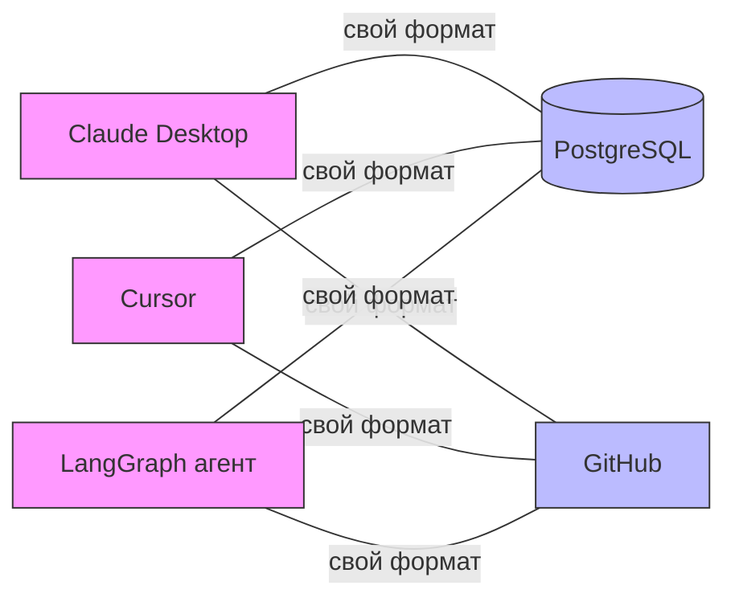

С MCP — один стандарт, один сервер работает со всеми клиентами:

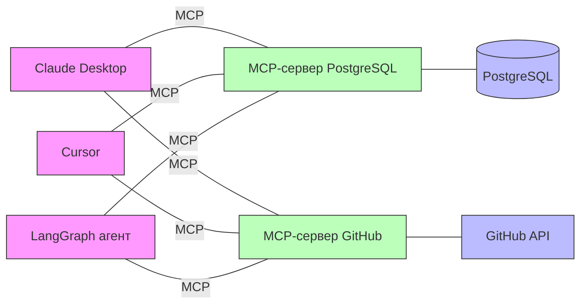

Один MCP-сервер — работает с любым MCP-клиентом. Один раз написал — используешь везде: в Claude Desktop, в Cursor, в своём агенте на LangGraph.

По сути MCP — это **стандарт описания и вызова возможностей**, как REST API стандартизировал веб-сервисы. Только здесь стандарт заточен под AI-агентов.

---

## Часть 1: Что такое MCP-сервер на самом деле

Прежде чем разбирать архитектуру, нужно понять главное: **MCP-сервер — это обычная программа**. Программа, внутри которой написаны функции, выполняющие реальную работу. Эти функции обёрнуты в MCP-протокол, чтобы AI-клиенты могли их обнаруживать и вызывать.

### Конкретный пример: сервер для PostgreSQL

Кто-то (Anthropic, сообщество или вы сами) написал программу `server-postgres`. Внутри неё — обычный Python-код:

```python
import psycopg2

@mcp.tool()
def query(sql: str) -> str:
    """Выполняет SQL-запрос к базе данных"""
    conn = psycopg2.connect("postgresql://localhost/mydb")
    result = conn.execute(sql)
    return str(result.fetchall())

@mcp.tool()
def list_tables() -> str:
    """Показывает все таблицы в базе"""
    conn = psycopg2.connect("postgresql://localhost/mydb")
    result = conn.execute(
        "SELECT table_name FROM information_schema.tables"
    )
    return str(result.fetchall())
```

Обычные функции, которые ходят в базу данных. Ничего магического. Но они обёрнуты в `@mcp.tool()` — а значит, к ним можно обращаться по стандартному MCP-протоколу.

### Что получает клиент

Когда AI-клиент подключается к этому серверу, он получает **не код функций**, а их **описание**:

```json
{
  "tools": [
    {
      "name": "query",
      "description": "Выполняет SQL-запрос к базе данных",
      "inputSchema": {
        "properties": { "sql": {"type": "string"} },
        "required": ["sql"]
      }
    },
    {
      "name": "list_tables",
      "description": "Показывает все таблицы в базе"
    }
  ]
}
```

Название, описание и какие параметры принимает. Этого достаточно, чтобы AI понял: "я могу вызвать `query` и передать туда SQL".

### Где выполняется код

**Код выполняется на стороне сервера, не на стороне клиента.** Клиент отправляет запрос "вызови `query` с параметром `SELECT * FROM users`", сервер выполняет SQL у себя и возвращает результат. Это как REST API: когда вы делаете `POST /api/users`, вы не скачиваете код сервера — вы отправляете запрос, сервер делает работу, вы получаете ответ.

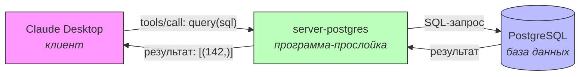

Без этой прослойки Claude не умеет ходить в базу. С ней — умеет, потому что прослойка делает это за него.

### Важное следствие: где должен работать сервер

MCP-сервер и ресурс, к которому он обращается, **должны видеть друг друга по сети**. Если база у вас локально — сервер тоже нужно запускать локально:

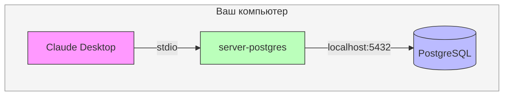

Если база на удалённом сервере — MCP-сервер можно запустить рядом с ней:

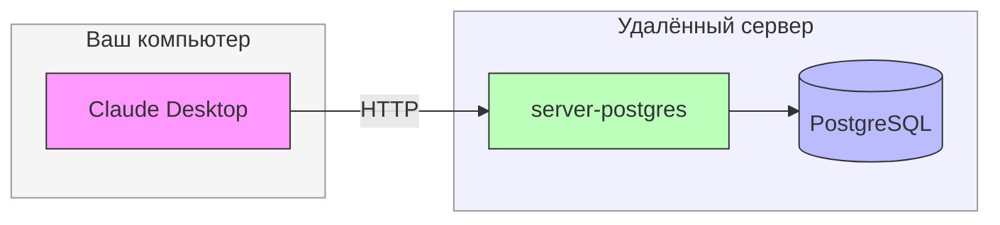

---

## Часть 2: Как клиент и сервер общаются (пошагово)

Разберём точную последовательность сообщений при подключении клиента к серверу. Все сообщения — это JSON-RPC 2.0 (стандартный формат с полями `method`, `params`, `id` для запросов и `result`/`error` для ответов).

### Шаг 1: Handshake — знакомство

Клиент подключается и представляется. Сервер отвечает, что умеет:

```
КЛИЕНТ → серверу:
{
  "jsonrpc": "2.0", "id": 1,
  "method": "initialize",
  "params": {
    "protocolVersion": "2025-03-26",
    "clientInfo": {"name": "claude-desktop"}
  }
}

СЕРВЕР → клиенту:
{
  "jsonrpc": "2.0", "id": 1,
  "result": {
    "protocolVersion": "2025-03-26",
    "serverInfo": {"name": "server-postgres"},
    "capabilities": { "tools": {} }   ← "у меня есть инструменты"
  }
}
```

Теперь клиент знает: этот сервер предоставляет Tools.

### Шаг 2: Каталог — что есть на сервере

Клиент запрашивает список инструментов:

```
КЛИЕНТ → серверу:
{ "jsonrpc": "2.0", "id": 2, "method": "tools/list" }

СЕРВЕР → клиенту:
{
  "jsonrpc": "2.0", "id": 2,
  "result": {
    "tools": [
      {
        "name": "query",
        "description": "Выполняет SQL-запрос",
        "inputSchema": {
          "properties": { "sql": {"type": "string"} },
          "required": ["sql"]
        }
      },
      {
        "name": "list_tables",
        "description": "Показывает все таблицы в базе"
      }
    ]
  }
}
```

Клиент теперь знает: есть `query(sql)` и `list_tables()`.

### Шаг 3: Вызов — используем инструмент

AI-модель решает вызвать инструмент, клиент передаёт запрос серверу:

```
КЛИЕНТ → серверу:
{
  "jsonrpc": "2.0", "id": 3,
  "method": "tools/call",
  "params": {
    "name": "query",
    "arguments": {"sql": "SELECT COUNT(*) FROM users"}
  }
}

СЕРВЕР выполняет SQL у себя, получает результат, отдаёт:

СЕРВЕР → клиенту:
{
  "jsonrpc": "2.0", "id": 3,
  "result": {
    "content": [
      {"type": "text", "text": "[(142,)]"}
    ]
  }
}
```

### Шаг 4: Завершение

Клиент закрывает соединение, сервер завершает работу.

### Полная картина

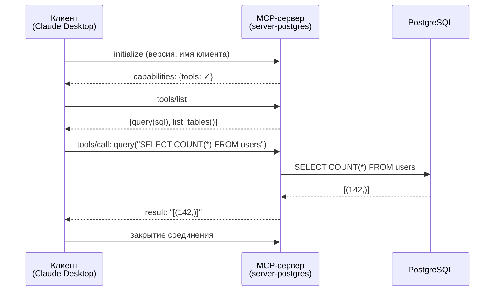

### А при чём тут AI?

Когда MCP используется с AI-моделью, добавляется ещё один участник. Вот что происходит, когда пользователь спрашивает "Сколько пользователей зарегистрировалось?":

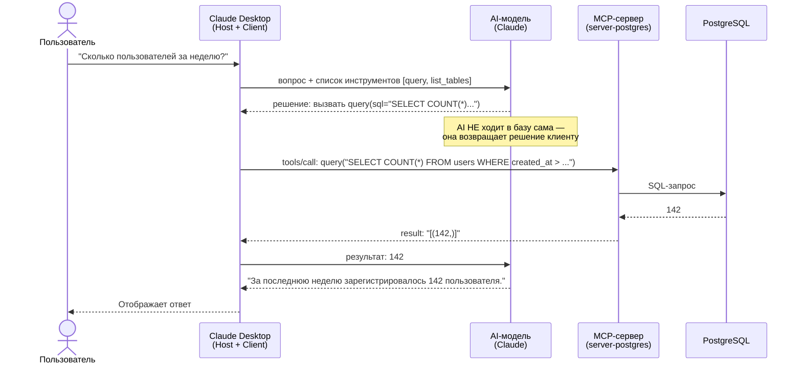

AI-модель **не общается с сервером напрямую**. Она говорит клиенту "вызови вот этот инструмент с такими аргументами", а клиент передаёт это MCP-серверу.

---

## Часть 3: Transport — как доставляются сообщения

Содержимое сообщений всегда одинаковое (JSON-RPC). Но **способ доставки** может быть разным — как письмо можно отправить почтой или курьером.

### stdio — для локальных серверов

Клиент запускает сервер как дочерний процесс и общается с ним через stdin/stdout:

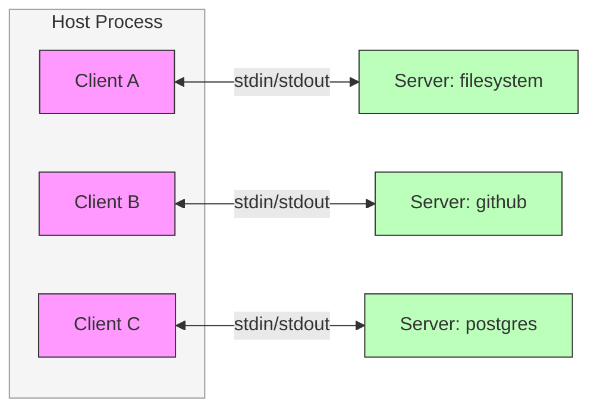

Клиент пишет JSON в stdin сервера, читает ответ из stdout. Быстро, просто, без сети. Это самый распространённый вариант — вы запускаете MCP-сервер у себя на машине, рядом с ресурсами, к которым он обращается.

### Streamable HTTP — для удалённых серверов

Сервер работает как обычный HTTP-сервер, клиент шлёт POST-запросы:

```python
# Сервер запускается с HTTP-транспортом
mcp.run(transport="streamable-http", host="0.0.0.0", port=8000)
```

```
КЛИЕНТ:
POST http://server-address:8000/mcp
Body: {"method": "tools/call", "params": {"name": "query", ...}}

СЕРВЕР:
200 OK
Body: {"result": {"content": [{"text": "[(142,)]"}]}}
```

Те же JSON-RPC сообщения, но доставляются по HTTP. Поддерживает как обычные request-response, так и стриминг через Server-Sent Events (SSE).

### Когда что использовать

| Транспорт | Когда | Пример |
|-----------|-------|--------|
| **stdio** | Сервер на вашей машине | Файловый сервер, локальная БД |
| **Streamable HTTP** | Сервер в сети / на другой машине | Корпоративная БД, облачный API |

Выбор JSON-RPC как формата сообщений не случаен: это проверенный протокол, используемый в LSP (Language Server Protocol), Ethereum и других системах. MCP вдохновлён LSP — только вместо "сервер понимает код" это "сервер предоставляет возможности для AI".

---

## Часть 4: Архитектура — три роли

MCP определяет три роли в системе взаимодействия.

**Host** — приложение, в котором работает пользователь. Claude Desktop, VS Code с AI-расширением, ваше кастомное приложение. Host отвечает за интерфейс, управление сессиями и безопасность. Важно: Host — это не языковая модель, а *оболочка*, в которой модель работает.

**Client** — компонент внутри Host, который устанавливает соединение с MCP-серверами. Каждый Client поддерживает соединение 1:1 с конкретным Server. Если Host подключается к трём серверам (файлы, GitHub, база данных), он создаёт три отдельных Client.

**Server** — программа, предоставляющая возможности (capabilities) для AI-модели. Сервер может быть локальным процессом или удалённым сервисом. Именно сервер выполняет реальную работу: ходит в базу, читает файлы, вызывает API.

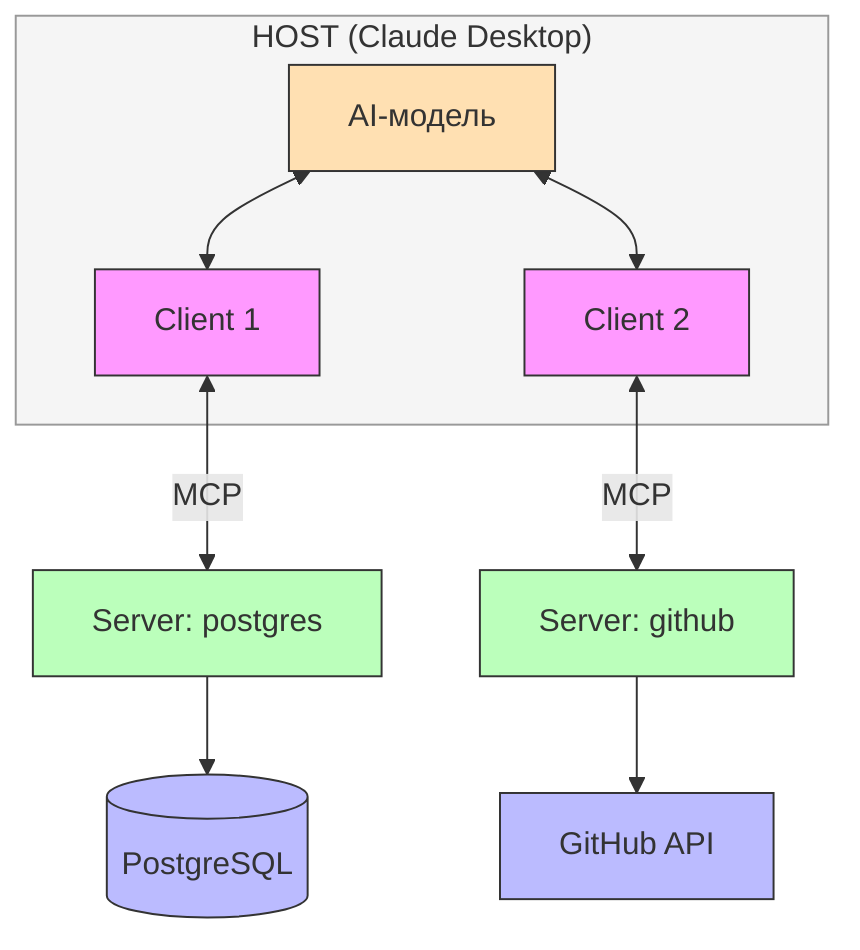

### Жизненный цикл соединения

Соединение между Client и Server проходит четыре фазы:

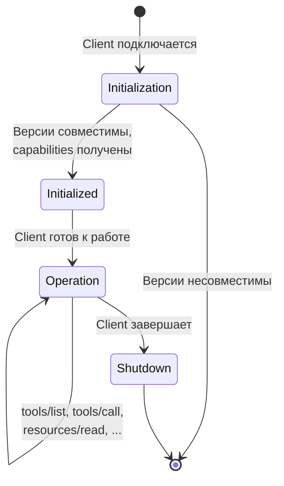

1. **Initialization** — рукопожатие. Client сообщает о себе, Server отвечает своими capabilities (какие типы возможностей поддерживает). Согласуется версия протокола — если несовместимы, соединение не устанавливается.

2. **Initialized** — Client подтверждает готовность к работе.

3. **Operation** — основная фаза. Client и Server обмениваются запросами.

4. **Shutdown** — завершение соединения.

Фаза initialization критична: именно здесь Server сообщает, какие из трёх типов capabilities он поддерживает (Tools, Resources, Prompts). Client не будет запрашивать то, что Server не объявил.

---

## Часть 5: Три типа Capabilities

MCP-сервер может предоставлять три категории возможностей. Это отличает MCP от простого Function Calling, где есть только "инструменты".

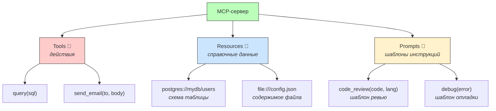

### Tools — руки сервера

Tools — это функции, которые сервер выполняет по запросу. Они **делают что-то**: отправляют запрос в базу, создают файл, публикуют сообщение.

Каждый инструмент имеет `name`, `description` и `inputSchema` (JSON Schema для параметров). AI-модель видит этот каталог и решает, когда какой инструмент вызвать.

Примеры: `query(sql)`, `read_file(path)`, `send_message(channel, text)`, `create_issue(title, body)`.

Важно: Tools имеют побочные эффекты — они изменяют внешний мир (пишут в базу, отправляют сообщения). Поэтому их нельзя кэшировать, и каждый вызов потенциально рискован.

### Resources — записная книжка сервера

Resources — это данные, которые сервер выставляет **заранее**, без вызова функций. Они ничего не делают — просто **отдают информацию**.

Например, MCP-сервер для PostgreSQL при подключении может сразу сообщить:

```text
У меня есть ресурсы:
- postgres://localhost/mydb/users    → схема таблицы users
- postgres://localhost/mydb/orders   → схема таблицы orders
```

AI-агент может прочитать схему таблицы **до** того, как писать SQL. Это справочная информация — её можно кэшировать, подписаться на изменения, читать сколько угодно раз без побочных эффектов.

Зачем отдельный тип? Потому что чтение данных и выполнение действий — принципиально разные операции с точки зрения безопасности. Resource безопасен: он ничего не меняет. Tool — нет.

### Prompts — инструкции сервера

Prompts — это готовые шаблоны промптов, которые сервер предлагает клиенту. Эксперт заранее написал идеальный промпт и упаковал его на сервер, чтобы любой клиент мог использовать.

Пример: MCP-сервер для код-ревью предлагает промпт `review(code, language)`. Клиент вызывает его, а сервер возвращает длинный детальный текст с инструкциями:

```text
"Проведи ревью Python-кода по следующим критериям:
 1. Проверь обработку ошибок
 2. Проверь именование переменных
 3. Проверь типизацию
 ...
 Вот код для ревью: ..."
```

Это **не AI генерирует** — это эксперт заранее составил инструкцию. Prompts полезны для:

- **Стандартизации** — все в организации используют одинаковый формат ревью
- **Инкапсуляции экспертизы** — промпт содержит знания специалиста
- **Создания "рецептов"** для частых задач (debug, explain, summarize)

### Сравнение

| Аспект | Tools | Resources | Prompts |
|--------|-------|-----------|---------|
| **Что это** | Действия | Справочные данные | Шаблоны инструкций |
| **Аналогия** | Руки | Записная книжка | Инструкция по применению |
| **Побочные эффекты** | Да (изменяет мир) | Нет (только чтение) | Нет |
| **Кэширование** | Нельзя | Можно | Можно |
| **Кто инициирует** | AI-модель | Приложение или модель | Пользователь |
| **Пример** | `send_email(to, body)` | `postgres://mydb/users` | `code_review(lang, code)` |

---

## Часть 6: MCP vs LangChain Tools

### Сравнение подходов

| Аспект | LangChain Tools | MCP |
|--------|----------------|-----|
| **Суть** | Библиотека инструментов | Протокол интеграции |
| **Привязка** | К экосистеме LangChain | Агностичен к фреймворку |
| **Типы capabilities** | Только Tools | Tools + Resources + Prompts |
| **Где выполняется код** | В том же процессе | В отдельном процессе |
| **Изоляция** | Нет | Да (sandbox) |
| **Готовые интеграции** | Богатая экосистема | Растущая экосистема |
| **Сложность** | Низкая | Средняя |

**Используйте LangChain Tools когда:**
- Пишете приложение на LangChain/LangGraph
- Нужна быстрая интеграция "здесь и сейчас"
- Инструменты специфичны для вашего приложения
- Не требуется изоляция кода

**Используйте MCP когда:**

- Создаёте переиспользуемую интеграцию для нескольких приложений
- Нужна изоляция (инструмент работает с чувствительными данными)
- Интеграция должна работать с Claude Desktop, Cursor и другими MCP-клиентами
- Хотите стандартизировать интеграции в организации

**Правило:** если инструмент будет использоваться в 2+ приложениях или вам нужна изоляция — MCP. Если инструмент "живёт" только внутри вашего агента — обычная функция или LangChain Tool.

### Гибридный подход

На практике оба подхода часто сочетаются. Пакет `langchain-mcp-adapters` позволяет использовать MCP-серверы как обычные LangChain-инструменты:

```python
from langchain_mcp_adapters.client import MultiServerMCPClient
from langgraph.prebuilt import create_react_agent

async with MultiServerMCPClient({
    "filesystem": {
        "command": "npx",
        "args": ["-y", "@modelcontextprotocol/server-filesystem", "/workspace"],
        "transport": "stdio",
    }
}) as client:
    tools = client.get_tools()  # MCP-инструменты в формате LangChain
    agent = create_react_agent(llm, tools)
```

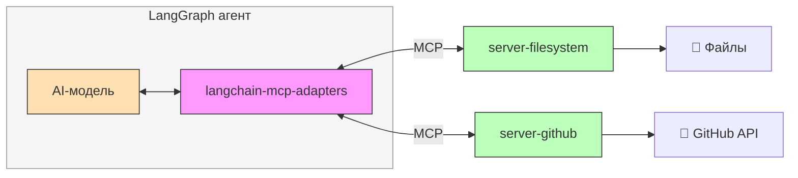

Экосистема MCP-серверов + оркестрация LangGraph = лучшее из двух миров.

---

## Часть 7: Создание MCP-сервера

### FastMCP — высокоуровневый API

Создание MCP-сервера так же просто, как написание обычных Python-функций, благодаря `FastMCP`:

```python
from mcp.server.fastmcp import FastMCP

mcp = FastMCP("my-server")

@mcp.tool()
def greet(name: str) -> str:
    """Приветствует пользователя по имени"""
    return f"Привет, {name}!"

@mcp.resource("config://app")
def get_config() -> str:
    """Конфигурация приложения"""
    return json.dumps({"version": "1.0", "debug": False})

@mcp.prompt()
def review(code: str, language: str = "python") -> str:
    """Промпт для код-ревью"""
    return f"Проведи ревью {language} кода:\n```{language}\n{code}\n```"

if __name__ == "__main__":
    mcp.run()
```

FastMCP автоматически генерирует `inputSchema` из сигнатуры функции и обрабатывает все детали протокола. Три декоратора — `@mcp.tool()`, `@mcp.resource()`, `@mcp.prompt()` — это всё, что нужно знать для 90% случаев.

### FastMCP vs низкоуровневый API

FastMCP — это "batteries included" подход. Но если нужен полный контроль, есть низкоуровневый API (`from mcp.server import Server`), где вы вручную регистрируете обработчики через декораторы `@server.list_tools()`, `@server.call_tool()` и т.д.

Когда нужен низкоуровневый API:

- Динамическая регистрация инструментов (набор инструментов меняется в runtime)
- Сложная логика авторизации per-tool
- Кастомная обработка ошибок на уровне протокола
- Интеграция с существующим async-приложением

Для учебных и большинства production-случаев FastMCP достаточен.

### Тестирование сервера

MCP Inspector — визуальный инструмент для тестирования MCP-серверов:

```bash
npx @modelcontextprotocol/inspector python my_server.py
```

Это откроет веб-интерфейс, где можно интерактивно вызывать инструменты, читать ресурсы и получать промпты. Незаменим для отладки: вы видите JSON-RPC сообщения, ответы сервера и ошибки в реальном времени.

---

## Часть 8: Экосистема готовых серверов

### Официальные серверы

Anthropic и сообщество создали готовые MCP-серверы для популярных сервисов. Каждый — это программа, которую вы скачиваете и запускаете у себя:

| Сервер | Что делает | Ключевые инструменты |
|--------|-----------|---------------------|
| `server-filesystem` | Работает с файлами на диске | read_file, write_file, search_files |
| `server-github` | Ходит в GitHub API | search_repos, create_issue, create_PR |
| `server-postgres` | Выполняет SQL в PostgreSQL | query + Resources (схема таблиц) |
| `server-slack` | Работает со Slack | send_message, list_channels |
| `server-memory` | Хранит данные между сессиями | store, retrieve, search |

Запуск типичного сервера:

```bash
npx -y @modelcontextprotocol/server-filesystem /path/to/directory
```

### Конфигурация в Claude Desktop

Claude Desktop подключает серверы через JSON-конфигурацию. Файл: `~/Library/Application Support/Claude/claude_desktop_config.json` (macOS) или `%APPDATA%\Claude\claude_desktop_config.json` (Windows).

```json
{
  "mcpServers": {
    "filesystem": {
      "command": "npx",
      "args": ["-y", "@modelcontextprotocol/server-filesystem", "/Users/me/projects"]
    },
    "github": {
      "command": "npx",
      "args": ["-y", "@modelcontextprotocol/server-github"],
      "env": { "GITHUB_TOKEN": "ghp_xxxxxxxxxxxx" }
    },
    "custom": {
      "command": "python",
      "args": ["/path/to/my_server.py"]
    }
  }
}
```

После изменения конфигурации перезапустите Claude Desktop. Обратите внимание: каждый сервер — отдельный процесс. Падение одного не влияет на остальные. Это же обеспечивает изоляцию: filesystem-сервер не имеет доступа к GitHub-токену, и наоборот.

---

## Часть 9: Интеграция MCP с LangGraph

### MCP как источник инструментов

`langchain-mcp-adapters` позволяет подключить несколько MCP-серверов одновременно и использовать их инструменты в LangGraph-агенте:

```python
from langchain_mcp_adapters.client import MultiServerMCPClient
from langgraph.prebuilt import create_react_agent
from langchain_openai import ChatOpenAI

async with MultiServerMCPClient({
    "filesystem": {
        "command": "npx",
        "args": ["-y", "@modelcontextprotocol/server-filesystem", "/workspace"],
        "transport": "stdio",
    },
    "github": {
        "command": "npx",
        "args": ["-y", "@modelcontextprotocol/server-github"],
        "env": {"GITHUB_TOKEN": os.environ["GITHUB_TOKEN"]},
        "transport": "stdio",
    }
}) as client:
    tools = client.get_tools()
    agent = create_react_agent(ChatOpenAI(model="gpt-5-mini"), tools)
    result = await agent.ainvoke({
        "messages": [{"role": "user", "content": "Найди все Python файлы и создай issue с их списком"}]
    })
```

`MultiServerMCPClient` управляет жизненным циклом всех серверов: запускает процессы, проводит initialization, собирает инструменты, а при выходе из `async with` — корректно завершает соединения.

### Динамическое подключение

Конфигурацию серверов можно формировать динамически — подключать GitHub-сервер только когда задача требует работы с репозиторием, а postgres-сервер — только при вопросах к базе данных. Это экономит ресурсы и уменьшает "шум" от лишних инструментов в контексте модели.

---

## Часть 10: Безопасность в MCP

### Почему безопасность MCP особенно важна

MCP-серверы предоставляют AI-модели доступ к внешним системам: файлам, базам данных, API. Модель может быть обманута prompt injection, пользователь может злоупотребить доступом, а ошибка в сервере может открыть уязвимость.

### Принцип минимальных привилегий

Каждый MCP-сервер должен получать минимально необходимые права:

- **Filesystem-сервер:** доступ только к конкретной директории (не к `/`)
- **Database-сервер:** read-only пользователь, доступ только к нужным таблицам
- **GitHub-сервер:** токен с минимальным scope (только `repo`, а не все разрешения)

Даже если модель "убеждена" сделать что-то вредоносное, ограничения на уровне сервера не позволят.

### Sandboxing через процессную изоляцию

Поскольку MCP-серверы работают как отдельные процессы, их можно запускать в изолированном окружении:

```bash
docker run --rm -i \
  -v /host/data:/data:ro \   # Read-only доступ к данным
  --network none \             # Без доступа к сети
  --memory 256m \              # Лимит памяти
  mcp-filesystem-server /data
```

Три уровня изоляции: read-only файловая система, отключённая сеть, лимит памяти.

### Валидация входных данных

Критическая уязвимость MCP-серверов — **path traversal**. Если filesystem-сервер принимает путь от клиента без проверки, злоумышленник может запросить `../../etc/passwd`. Защита — канонизация пути:

```python
from pathlib import Path

ALLOWED_ROOT = Path("/home/user/workspace")

def validate_path(path_str: str) -> Path:
    path = Path(path_str).resolve()
    if not str(path).startswith(str(ALLOWED_ROOT)):
        raise ValueError(f"Access denied: path outside allowed directory")
    return path
```

Этот паттерн должен применяться к *любому* серверу, который принимает пути, URI или идентификаторы ресурсов от клиента.

### Аудит

Логируйте все вызовы инструментов: кто вызвал, с какими аргументами, что вернулось. Сервер — отдельный процесс, и его логи могут быть единственным способом понять, что произошло при инциденте.

---

## Часть 11: Ограничения и будущее MCP

### Текущие ограничения

MCP — молодой протокол с проблемами роста:

**Latency.** Каждый вызов инструмента — это межпроцессное взаимодействие. Для stdio — микросекунды, для HTTP — миллисекунды. При десятках вызовов в цепочке рассуждений overhead суммируется.

**Отладка.** Проблема может быть в клиенте, сервере, транспорте или протоколе. MCP Inspector помогает, но отладка распределённых систем всегда сложнее, чем in-process вызовы.

**Версионирование.** Протокол активно развивается. Сервер одной версии может не работать с клиентом другой. Фаза initialization решает это (стороны согласуют версию), но обновление экосистемы занимает время.

**Экосистема.** Количество готовых MCP-серверов растёт, но пока не сравнимо с экосистемой LangChain Community. Для нишевых интеграций, скорее всего, придётся писать свой сервер.

### Когда MCP — это overkill

MCP решает проблему *переиспользуемости*. Если ваш инструмент специфичен для одного приложения и никогда не будет использоваться в другом контексте — MCP создаёт ненужную сложность. Отдельный процесс — это overhead по памяти, latency, дополнительная точка отказа.

### Куда движется MCP

Поддержка со стороны Anthropic, растущее adoption в IDE (Cursor, VS Code, Claude Code) и включение в стандарты всё большего числа компаний говорят о том, что MCP имеет шансы стать де-факто стандартом. Но успех определяется не качеством спецификации, а широтой adoption.

---

## Заключение

MCP — это **стандартный формат**, по которому AI-агент может узнать, что умеет сервер, и вызвать нужные возможности. Один сервер — работает с любым клиентом. Один формат — вместо десятка несовместимых.

Ключевое:

1. **MCP-сервер** — обычная программа-прослойка, которая выполняет реальную работу (SQL-запросы, чтение файлов, вызовы API) и предоставляет свои возможности по стандартному протоколу
2. **Клиент** не получает код — он получает описание возможностей и вызывает их, получая результат
3. **Три типа capabilities** — Tools (действия), Resources (данные), Prompts (шаблоны инструкций)
4. **Два транспорта** — stdio (локально) и HTTP (по сети), содержимое сообщений одинаковое
5. **Гибридный подход** — MCP + LangChain через `langchain-mcp-adapters` даёт лучшее из двух миров

---

## Вопросы для самопроверки

1. Что такое MCP-сервер? Где выполняется код — на стороне клиента или сервера?

2. Что получает клиент при подключении к MCP-серверу — код функций или их описание?

3. Чем отличаются Tools, Resources и Prompts? Приведите пример каждого.

4. В чём разница между stdio и HTTP транспортом? Когда какой использовать?

5. Сравните MCP и LangChain Tools: когда предпочтительнее каждый подход?

6. Как обеспечить безопасность MCP-сервера, работающего с файловой системой?

7. Когда MCP — overkill? Приведите критерии выбора.

---

## Ключевые термины

| Термин | Определение |
|--------|-------------|
| **MCP** | Model Context Protocol — стандартный формат взаимодействия AI-агентов с внешними системами |
| **Host** | Приложение пользователя (Claude Desktop, IDE), в котором работает AI-модель |
| **Client** | Компонент Host, который подключается к MCP-серверу и передаёт ему запросы |
| **Server** | Программа-прослойка: выполняет реальную работу и предоставляет возможности по MCP-протоколу |
| **Tools** | Возможности для выполнения действий (руки сервера) |
| **Resources** | Справочные данные, доступные для чтения (записная книжка сервера) |
| **Prompts** | Готовые шаблоны промптов от экспертов (инструкции сервера) |
| **FastMCP** | Высокоуровневый Python API для создания MCP-серверов |
| **stdio** | Транспорт через stdin/stdout — для локальных серверов |
| **Streamable HTTP** | Транспорт через HTTP POST — для удалённых серверов |
| **JSON-RPC** | Формат сообщений, используемый в MCP |
| **MCP Inspector** | Визуальный инструмент для тестирования и отладки MCP-серверов |
